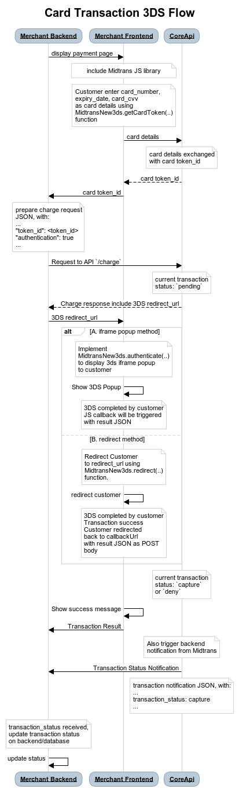
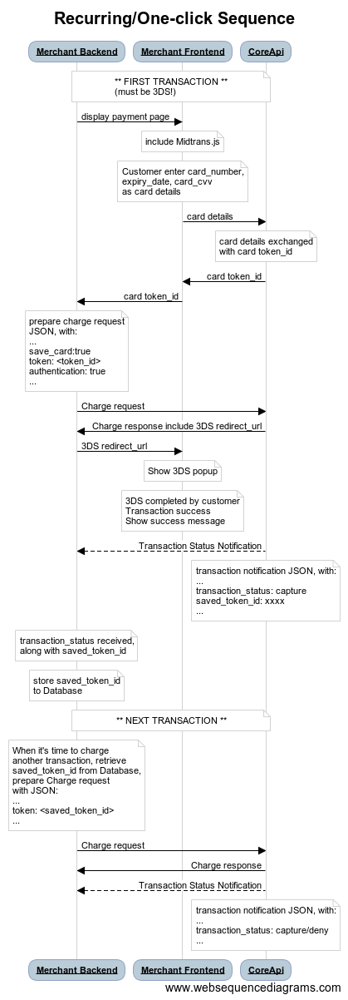
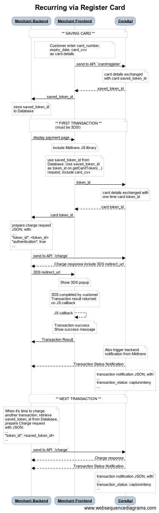
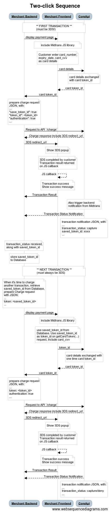
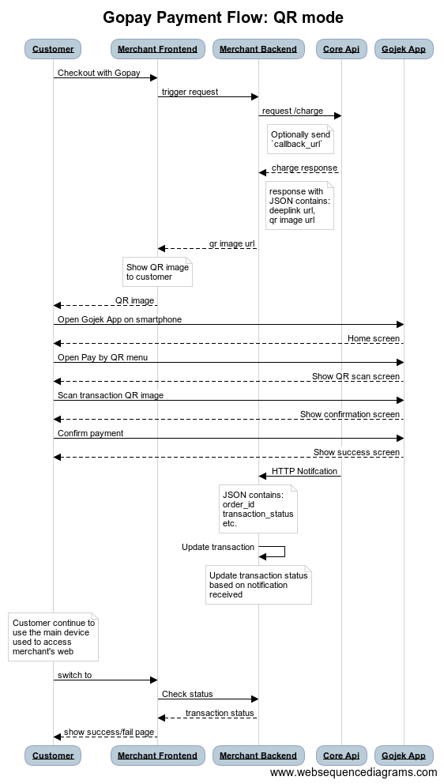

## FAQ General Topic

### Which Credit Card acquiring bank that need BCA MIGS Pilot testing?
BCA, Maybank, BRI. Full Payment and Installment

### Why Snap Popup doesn’t work on merchant mobile app?
- If merchant mobile app use webview to display snap popup, make sure the app configuration follow these points:
Enable Javascript capability for the webview.
Allow webview to open bank web domain (for reasons that will be explained below).
- If testing on sandbox, allow webview to open Midtrans simulator domain: https://simulator.midtrans.com 
Those configs may be found on app config/manifest. Or specific code when calling webview.

**Reasoning :**

Because a lot of payment methods within snap will redirect customer to bank website, merchant mobile dev need to make sure the app allow webview to open bank website domains. Which might mean whitelisting any domain to be opened, because in case of credit card, customers can use any issuing bank credit card, which the web domain can be anything.

### Can Merchant revoke or cancel an active Snap Token to prevent customer proceed the transaction?
There's no official revoke or cancel API method for Snap token.

However there's some work around: 
- If you know how long you will need an Snap token to active, you can set via `expiry` JSON parameter. Make sure to set `start_time`. Or
- Do another `createTransaction()` with **same order ID** to obtain another token, it will revoke the old token, only the latest 1 should active.

If you just need to close payment popup on customer browser, using frontend javascript you can call `snap.hide()` function to close the payment popup.


### Merchant want to use Bin API ( /v1/bins/bin_number), but getting "Invalid authentication credentials"?
In order to use this API, need to manually request Turbo team to whitelist the specific merchant. Provide Merchant ID & environment.

note: On #pilar Slack channel, search for "Please consult with gaia team regarding the inquiry"

### Merchant want to use Offline Installment payment, how they should implement it?
It’s recommended to have separate payment flow (can be separate payment button, etc) for Offline Installment.

For offline installment merchant have to use `whitelist_bins`, customer can only pay with the whitelisted card only. Hence customer cannot use it to pay using other card for full payment or other banks that are not in whitelist_bins.

It doesn’t have to be different `button`, UX wise merchant can make it as checkboxes “I want to pay with <Offline Installment bank> Installment” for customer to check, etc. As long as it can give merchant backend information that your customers want to pay with offline installment, and merchant backend send the `whitelist_bins` accordingly.

### Merchant want to use credit card BIN based promo campaign, how they should implement it? 
It’s recommended to have separate payment flow (can be separate payment button, etc) for BIN specific promo.

For BIN specific promo merchant have to use `whitelist_bins`, customer can only pay with the whitelisted card only. Hence customer cannot use it to pay using other card for full payment or other banks that are not in whitelist_bins.

It doesn’t have to be different `button`, UX wise merchant can make it as checkboxes “I want to pay with <BIN specific promo>” for customer to check, etc. As long as it can give merchant backend information that your customers want to pay with BIN specific promo, and merchant backend send the `whitelist_bins` accordingly.

### Merchant want to use payment method specific campaign, how they should implement it?
It’s recommended to have separate payment flow (can be separate payment button, etc) for payment method specific promo.

For payment method specific promo merchant have to use `enabled_payments`, customers can only pay with the specific payment method only. Hence customer cannot use it to pay using other payment method.

It doesn’t have to be different `button`, UX wise merchant can make it as checkboxes “I want to pay with < payment method >” for customer to check, etc. As long as it can give merchant backend information that your customers want to pay with specific payment method, and merchant backend send the `enabled_payments` accordingly.

### Why Midtrans HTTP notification looks "empty" when received on merchant backend / notification handler?
It can be caused by `notification_url` (set by merchant on Dashboard) is ending up in HTTP redirect, when HTTP notification sent by Midtrans notification engine. If HTTP redirect happens, it can cause HTTP POST call to be redirected as HTTP GET, which means it will no longer contains HTTP body which contains the transaction data. Resulting in merchant notification handler getting empty request body, and might throw error. Redirect can be caused by network/reverse proxy/web framework used by merchant.

**To resolve**:

Make sure there is no redirect on the `notification_url` set on dashboard. You can open the url on web browser, then see whether the end url is the same as the original url or not, if different, it means there is a redirect. Use the last url displayed on browser URL bar, after you open the original url as `notification_url`.

### Why Permata VA cannot be customized?
Permata custom VA only available for B2B VA type. Permata B2C VA type cannot be customized.

### Why is Customer’s credit card transaction got denied / rejected?
Reason of denied credit card transaction can be checked on merchant Dashboard, on payments menu, search and click the transactions order id. On “**Transaction failure**” red indicator, click the little `(i)` icon, deny reason will be displayed.

### Customer transactions are denied because of fraud detection system, but merchant trust the customer, can merchant request whitelist?
If the customer is trusted and Merchant wish to whitelist the customer, please provide the list of customer emails and send the request as email to operations.fraud@midtrans.com

### Customer card denied by bank / blocked on OTP page, customer asked the bank, the bank tell customer that the card is having no issue. What should merchant do?
If the card is blocked within the OTP/3ds page of the card issuer/bank. Customer should contact card issuer/bank call center. Customer should provide the screenshot/message of the 3DS page issue to card issuer/bank. Some card issuer/bank might mistakenly check only if the card have offline payment issue or not, they might not check from online/3DS perspective whether it’s able to transact online or not. customer should mention they are unable to pay on 3DS enabled online merchant, so the call center can understand.

Payment Gateway unfortunately can’t do much about it, because the block happen on Card Issuer (and their network) side. Customer should explain the issue to Card Issuer.

### Customer does not receive 3DS / OTP, so he can’t proceed with payment or can proceed but transaction become non 3DS. What’s the issue? What should merchant do?
In case of OTP not received by customer, the issue is between card issuer’s (bank’s) 3DS (OTP) page and the customer phone. This can be caused because for example:
- Card issuer 3DS page is currently down / under maintenance, 
- Card is blocked by card issuer because fraud attempt or incorrect OTP submitted too many times, 
- Customer phone is unreachable by the SMS service, customer phone don’t have enough credit to receive SMS, etc,
- Card issuer is having issue and downgrading the transaction to non 3DS.

Merchant should inform customer to contact their card issuer support center, they should explain in details that they are unable to do online transaction and did not receive 3DS / OTP. Also inform the error message displayed on the page if any. Make sure they explain about the issue is for online transaction, because in some cases card issuer support center might only check the card issue for offline transaction and tell customer the card is fine and able to transact.

### Merchant don’t want to pass real "customer_details" data to Midtrans, is there any consequences? how should merchant do? 
There is no legal or business constraint if merchant want to do that. But there might be technical consequences in terms of how Midtrans Fraud Detection System (FDS) works.
Few sample cases are:
- FDS have blacklist database of online fraudster, if customer is a fraudster, and merchant pass fake email, fraud might not be detected.
- FDS estimate fraud behavior based on transaction count for each email, phone number, and other unique data. If merchant sent static dummy email, it can get blocked after certain amount of transaction, To avoid this issue merchant should use dynamic dummy data, that is unique for each user. For example merchant can mask customer@email.com to MmtMPHTlqVZyE0@dummycompanyemail.com 

In most cases, merchant can just not sent the customer data, if the data is not mandatory. E.g: GOPAY transaction do not require customer email or phone number at all.

### While doing VA transaction, Merchant got error 505 “Unable to create va_number for this transaction.” What's the issue and what should merchant do?
The issue might happen because after several attempts bank unable to allocate VA number for the transaction at that moment. For error code 5xx. Please try to resend the request.

### Customer transaction is blocked by Fraud Detection System, but Merchant are sure the customer are legitimate and should be allowed to do transaction. What should merchant do?
Merchant can check the FDS deny reason by searching the transaction’s order id on Midtrans Dashboard. Click the order id for the order details, then click the (i) icon on the red/yellow highlighted text. Deny reason should be displayed.

If the customer are trusted and verified by Merchant, and Merchant think their transaction should be accepted, Merchant can request to whitelist specific customer by customer email. Please provide the customer email(s) to Midtrans FDS team via email to operations.fraud@midtrans.com  and explain they should be whitelisted. Our FDS team will respond promptly.

### Merchant is switching their system configuration from Midtrans Sandbox environment to Midtrans Production environment (or switching between different MID/Account), but when making credit card transactions they encounter error message "Credit card token is no longer available". What should merchant do?
The issue happen because the server key and client key mismatch. 
Please make sure both the client & server key used is coming from the same MID/account
Please make sure both the client & server key used is coming from the same environment (Sandbox/Production) of that MID/account.

### What is Pending, Settlement, Expire transaction status for asynchronous payment?
On asynchronous payment such as Bank Transfer, Go Pay, BCA Klikpay, etc. Payment code/id is created then should be displayed to the customer, along with the payment instruction (if you enable customer email notification or use Snap product). Next, customer need to complete the real payment (transfer the fund) using the payment provider website/Application/ATM etc.

The available payment statuses are:

- Deny: Payment provider rejected the payment code/id creation.
- Pending: Payment specific code for customer to pay is created. Customer need to complete payment at the bank/payment provider website/Application/ATM etc.
- Expire: Customer fail to pay at bank/payment provider within the specified expiry time.
- Cancel: Transaction is canceled by trigger from Merchant.
- Settlement: Customer payment at bank/payment provider is successfully confirmed.
- Refund: Transaction is refunded by trigger from Merchant.

### Merchant’s developer tested failure scenario within Go-Pay simulator, but nothing happens, transaction status still pending, what happens?
That is expected, in production mode a failure of payment within Go-Jek App will be contained only within the app, and will allow customer to retry payment. So failure is not notified to Midtrans or Merchant. Transaction status will remain pending, to allow retry attempt from customer. If customer fail to do successful payment until expiry-time exceeded (default expiry is 15 minutes) the transaction status will then change to `EXPIRE` and cannot be paid.

### For MIGS acquiring (and facilitator agreement type), if my customer says their card is deducted but Midtrans says the transaction is failure, what to do next?
<!-- TODO Translate to english -->
Untuk case mismatch status dengan acquiring bank yg menggunakan MIGS (yg biasanya hanya terjadi kalau sisi MIGS terjadi timeout), silahkan dari Merchant cek ke portal MIGS menggunakan akun yg di dapat dari pihak bank. Kemudian cek/search apakah id tersebut transaksinya success. ID yg bisa di search di portal MIGS adalah `transaction_id` pada response API Midtrans.

Kemudian jika memang transaksi success di portal MIGS, silahkan tentukan transaksi akan di cancel/refund, atau dibiarkan success. Jika dibiarkan success, silahkan infokan ke Midtrans agar kami menyamakan status transaksi menjadi success.

### Merchant is 3DS, card is 3DS, but 1st time transaction fail and no OTP/3DS displayed, what to do?
Search PAPI graylog by txn id, find for keyword `error` or keyword `exception`, for example you may find
```
done executing verify to netcetera with response={"session_id":"00259985-2a42-4196-bdf4-50c872c4ef71","error":{"message":"The input value for the element 'merchant.url' is missing.","code":"INP-MISS","element":"merchant.url"}}
```
It means Merchant URL is required but empty, ask merchant to complete their Dashboard Config.

### Merchant fail to be redirected to gojek:// deeplink on mobile app, what to do?
If merchant is using android app webview to open the deeplink url, webview need to be configured to allow open deeplink to other app 

Please make sure that the webview allow opening `gojek://` deeplink protocol, by following the link ref: https://stackoverflow.com/a/32714613

### Merchant developer encounter `javax.net.ssl.SSLHandshakeException: Received fatal alert: handshake_failure` when trying to connect to Midtrans API url, what to do?
This usually caused by outdated Java client. Please check the Java version, web framework version, and OS version used to connect. Please make sure you are not using outdated version, and stay updated, for example if your versions are: java version 1.7, web framework version Spring 3.1  and OS version windows 7. Please update. Java version 7 are no longer officially supported by Oracle (https://java.com/en/download/faq/java_7.xml ). Other than that Spring & OS version is also outdated. Using outdated platforms make your system vulnerable to security threats, which is not a suitable environment for handling payments.

### Merchant developer use React JS frontend framework, and unable to use midtrans.min.js / snap.js, what to do?
Please be aware that React does play nicely with regular JS library inside `<script>` tag. Both are same frontend based JS anyway, so they can still access each other. So include the midtrans.min.js / snap.js as `<script>`. `Veritrans` object still available as global `window.Veritrans` object inside react. `Snap` object still available as global `window.Snap` object inside react. Please refer to https://github.com/facebook/create-react-app/issues/3007#issuecomment-357863643 

### Customer complains the refund is not yet received, but on Midtrans Dashboard the status has already `refund`, can you check?
Unfortunately, access to fund status checking is not granted to Tech Support Team, we can only check the status technical wise. The actual fund checking will need to be inquired to Business Operations Team (which may reconcile with Go-Pay team as needed). To ensure you have correct point of contact and faster response regarding fund status, please follow below steps:

---------------------------
Here are some things that can be done if there are any mismatch in the transaction using the GO-PAY payment method:

1. If the customer complains that there is no refund after 3 working days from a refund submission to Midtrans, merchant needs to provide information to Midtrans Business Team and the Business Operations Team (bizops@midtrans.com) with the following detailed information:
	- Order ID
	- Transaction date
	- Gross amount
	- Refund amount
	- Screenshot of customer GO-PAY payment history, if any

2. If there is any mismatch found in the transaction on the customer’s payment proof and transaction data at MAP, then you can contact the Business Team and the Business Operations Team (bizops@midtrans.com) by providing the following information:
	- Order ID
	- Transaction Time
	- Transaction Amount
---------------------------

### Merchant use Midtrans provided CMS plugin/module, but found that it does not exactly suit their specific needs, can Midtrans help change the plugin/module?
Midtrans provides easy-to-install popular CMSes plugin/module to cover general merchant use cases plus some advanced features, and will try our best to cover use cases that are generally needed by most merchants. 

However, please note that any of the CMS module is developed as-is and without any warranty of it will cover all specific merchant needs, due to each merchant use case can be very different and custom. There is no one-fits-all solution for those. 

Midtrans publish and open source code of the modules. Merchant’s developer team should be able to further develop or use it as basis for their customization needs, because fulfilling merchant’s specific use cases should be their responsibility. 

Midtrans however is fully responsible to payment API service (not CMS plugin/module, but API), which you can let us know if there’s feedback for us to review related to the API. Midtrans will also consider implementing feedback for CMS plugin/module if the feedback can be beneficial to general use cases.

### Our customer/team tried to pay using a Debit Card, but we are getting responses that the transaction is denied, what is the issue?
Please note that not all debit card (especially in Indonesia) is activated by the card issuer (bank) for online payment. That can vary depends on card issuer (bank) regulation, most major Indonesian banks still doesn’t activate debit card for online transaction by default, because of security reasons. In this case, customer (card holder) should ask their card issuer (bank) whether their debit is activated for online transaction or not, before attempting to make online transactions.

Additionally, some customer service of card issuer (especially in Indonesia) also don’t really understand the difference between online and offline transactions, they would often mistakenly inform customer that the debit card is available for transactions. Customer should explains the issue in detail providing which website they try to transact, and evidence (screenshot, web url), etc if available. So the card issuer can better understand the case.

### How does Midtrans ensure customer card data is securely being transmitted to Midtrans and not compromised by 3rd party?
All the data transmission coming from customer device to Midtrans should be encrypted over the network layer via SSL/HTTPS. That means data transmission is end-to-end encrypted (customer-to-midtrans), and secure from any 3rd party. Only Customer and Midtrans side can see the real value of data being transmitted. Unless a 3rd party have direct control over the user’s device (which means already compromised anyway) or he able to decrypt SSL/HTTPS.

In order to ensure the customer-to-midtrans encryption are properly implemented, merchants are required to use official Midtrans provided javascript library for card transaction (midtrans.min.js, snap.js, or Mobile SDK) and strictly prohibited to record card credentials to their own system, unless PCI DSS certified. 
If you have proof of how a 3rd party can possibly break this security, feel free to contact us, we will connect you to our Infosec team.

Some auditors may see credentials transmitted in plain text, it is because the audit happen on the customer device itself. So ofcourse the data are visible from customer device. Auditor should try to check from non customer device, for example from network layer as 3rd party between midtrans and customer. Auditor will see the data is encrypted from 3rd party.

### Merchant is using GOPAY `callback_url` but customer does not redirected to expected url/deeplink what is wrong?
For GOPAY transaction, merchant can specify `callback_url`, customer will be redirected to `callback_url` after attempting GOPAY payment within GOJEK app, wether the result is failure or success. If customer did not get redirected properly, please check the following points:
- **Is customer making payment on GOJEK app via QR Code?**
Making payment by scanning QR will not result in redirect. Only `gojek://` deeplink method will result in redirect.

- **Do merchant use `http/https` protocol as the url?**
Make sure to add trailing slash `/`  at the end of the url. For example `https://myshop/finish_payment/`. GOPAY will automatically append `?<some-query>` at the end of the url, some web framework unable to handle `?` directly appended to your url like `https://myshop/finish_payment?order_id=123`, so you have to ensure to add `/`.

- **Do merchant use app deeplink protocol as the url?**
Make sure merchant app already handle that deeplink url, for example `slack://finis_payment/`, make sure the `slack` app can handle `/finish_payment` as deeplink

- **Do the callback_url trigger any redirect?**
Sometime that url trigger redirect to another url, or you have internal redirect rule within your network/device. Please check that url.

### How long is Gopay tranaction will be available to be paid after being created (after pending transaction status)?
By default expiry for Gopay transaction is 15 minutes. However this can be customized by sending additional JSON parameter during transaction creation. Merchant can send `custom_expiry` ([Core API](https://api-docs.midtrans.com/#charge-features)) or `expiry` ([Snap API](https://snap-docs.midtrans.com/#json-objects)) parameter.

It is **not recommended to set expiry below 15 minutes**, because Midtrans' expiry scheduler only reliably expire transaction with 15 minutes or more expiry. If merchant want the transaction to expire less than 15 minutes, they can utilize API [cancel](https://api-docs.midtrans.com/#cancel-transaction) or [expire](https://api-docs.midtrans.com/#expire-transaction) instead. Which merchant can trigger at anytime on a `pending` transaction.

### Can merchant retrieve/store GOPAY deeplink url in mobile app?
For Snap payment product:
Payment UI is managed by Midtrans
- If merchant are using Snap.js or redirect_url to display transaction, the GOPAY deeplink/QR url is currently not retrievable from merchant side.
- If merchant are using Midtrans Mobile SDK (native Android/iOS), deeplink are retrievable using the SDK.

For Core API payment product:
Integration is API based, so deeplink/QR url can be retrieved by merchant directly as API response and can be stored by merchant however they like.

### Why is customer GOPAY is deducted while the transaction is recorded as failure/expire on Midtrans Dashboard?
In the case of GOPAY system already deduct customer’s GOPAY but having technical issues that result in failure to notify Midtrans (and Merchant) about the transaction status, GOPAY system will auto-sync transaction on their end by refunding the payment. This mechanism intended to sync up transaction status between Merchant-Midtrans-GOPAY to failure state. Merchant can always refer to status on Midtrans, as accurate/final status. Merchant may advise customer to re-check their GOPAY balance periodically to ensure that their balance is refunded, as the refund can be instant or might take a while depends on GOPAY internal process. If customers still does not receive any refund, Merchant can email bizops[at]midtrans.com with following information: Order ID, Transaction date, Gross amount

### How to use Core API **register card** endpoint from frontend?
Please follow [this demo](https://gist.githack.com/rizdaprasetya/cecce986cb3c71ca0ec1a404d3063105/raw/4fadc5e425b4ddc770a005e33383fd1a8e481134/index.html ':include :type=iframe width=100% height=400px')

### Merchant use Mobile SDK but unable to get Snap Token, how to resolve it?
Typically the Mobile SDK transaction flow is: 
1. Merchant mobile dev config & setup Midtrans Android/iOS SDK especially the environment, clientKey & merchantServerURL
2. Given correct implementation, SDK will do API request to merchantServerURL to retireve Snap transaction token
3. Backend implementation of that merchant server will forward the API request to Midtrans' Snap API endpoint, adding HTTP auth header from serverKey
4. Snap API will respond with token, merchant server need to print/output the API response as-is
5. SDK will auto parse the API response, and once token retrieved, payment page will be started.

Things to do:
- Make sure that on 1# you have config the correct sandbox environment, merchantServerUrl & clientKey.
- Make sure that on app, the [SDK implementation is correctly following the docs](https://mobile-docs.midtrans.com/)
- Make sure to implement merchant server / backend.
- Make sure that on backend / 3# you have config the correct serverKey and API endpoint to correct sandbox config.
- Incase the issue persists, please share any error messages recorded on log, either from the Mobile or backend.
- Check the backend log to see if it's able to get API response from Snap API, sometime API can reject invalid request. Provide the log to us if needed to check. Or at least the order_id of transaction, so we can crosscheck it with our API log.

### Can you explain the implementation details of Credit Card 3DS transaction?

Please refer to this sample implementation:
- https://github.com/Midtrans/midtrans-nodejs-client/blob/master/examples/expressApp/views/core_api_credit_card_frontend_sample.ejs
- https://github.com/Midtrans/midtrans-python-client/blob/master/examples/flask_app/templates/core_api_credit_card_frontend_sample.html

Or please refer to this demo:
- https://anice.win/3ds_new/

Which source code is available at:
- https://gist.github.com/rizdaprasetya/9d16893578d600a03075939ef74c5c1f

Sequence diagram:



### Can you explain the flow of Recurring/One Click transaction?
Please refer to below sequence diagram:



### Can you explain the flow of Recurring/One Click transaction with Register Card API?
Please refer to below sequence diagram:



### Can you explain the flow of Two Click transaction?
Please refer to below sequence diagram:



### Can you explain the flow of Gopay transaction?
Please refer to below sequence diagram,

**Deeplink Mode**:


**QR Mode**:



### Merchant updated iOS SDK from v1.14.7 and below, but old implementation did not work after update. How to resolve it?

- Older SDK require config of `CC_CONFIG.secure3DEnabled = ...`, newer SDK no longer requires it, please remove that config. Then add this config `CC_CONFIG.authenticationType = MTAuthenticationType3DS`
- Please make sure that your backend/merchant-server will also accept that changes. Older SDK will generate request that have JSON keys `"secure" : true`, newer SDK will have `"authentication" : "3ds"`. Make sure there are no type checking or similar that are rejecting the JSON.

### There are some missing field/attributes on the JSON response/notification, it seems the JSON is not consistent, is this expected? 
In Midtrans, we are following [Google JSON Style Guide](https://google.github.io/styleguide/jsoncstyleguide.xml). According to the style guide it is recommended if a property doesn't have any value (`null`) then it should be removed. Reference: https://google.github.io/styleguide/jsoncstyleguide.xml#Empty/Null_Property_Values

So yes it is expected to have few missing JSON field/attribute, it means the value is `null` for that field/attribute. Please adjust your implementation accordingly to accomodate this behaviour.

### Why on iOS device Gopay deeplink is taking customer to different app and not Gojek?
Some apps might interfere with `gojek://` app deeplink url and taking over customer to their app. This behavior is caused by the app, if you find this keep happening please report the intefering app to us and Gojek team will raise the issue to iOS app store for further investigation. As temprorary please inform customer to uninstall the app that causing the interference.

### Why Merchant unable to do other VA transaction on Snap / Mobile SDK?
Please check during Snap token creation, if merchant send `enabled_payments` parameter.
Sending 
```
"enabled_payments": ["other_va"]
``` 
may not work, please change to
```
"enabled_payments": ["other_va","bni_va"]
``` 
or 
```
"enabled_payments": ["other_va","permata_va"]
```
Because behind the scene `other_va` will need to utilize BNI or Permata VA for the transaction.

### How to debug network / API call on Midtrans iOS SDK to check for any API validation error?
Please enable network logging using:
```[[MidtransNetworkLogger shared] startLogging];```
You can provide us the network log result for any issue.

<br><br><br><br><br><br><br><br><br><br><br><br><br><br><br><br><br><br><br><br><br><br><br><br><br><br><br>

.